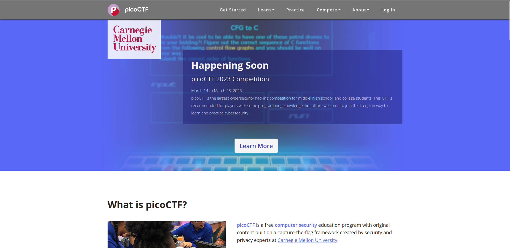

# PICOCTF Platform Program 2k22 Write-Ups

Welcome to PICOCTF Platform Challenges' Write-Ups Repository, you can find all detailed solutions of each ctf's challenge.

## Introduction 

picoCTF is a free computer security education program with original content built on a capture-the-flag framework created by security and privacy experts at Carnegie Mellon University.

Accessible via this link : https://picoctf.org/

## Content

 - [Cryptography](./cryptography/)
 - [Forensics](./forensics/)
 - [General Skills](./general_skills/)
 - [Reverse Engineering](./reverse_engineering/)
 - [Web Exploitation](./web_exploitation/)
 - [Binary Exploitation (PWN)](./pwn/)