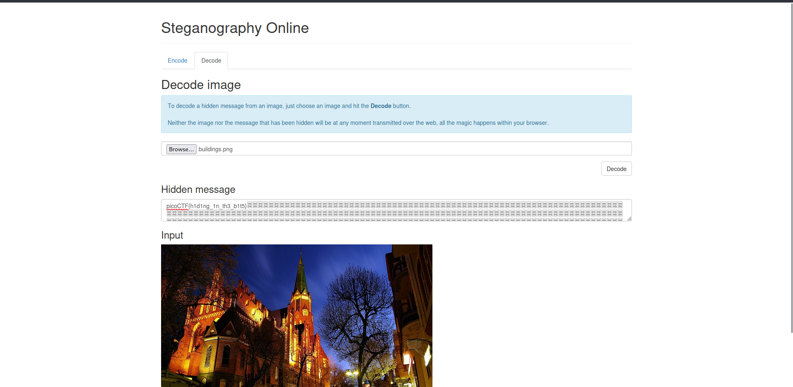

# What_Lies_Whithin

## Description

> Theres something in the building. Can you retrieve the flag?

## Hints

> There is data encoded somewhere, there might be an online decoder

## Write-Up

So as the hint say, there must be decoder online, I search “image decoder online” of course…. And I found this [Steganography site](https://stylesuxx.github.io/steganography/). Chose the decode tab and upload the image, and press “Decode”.

## Flag

picoCTF{h1d1ng_1n_th3_b1t5}